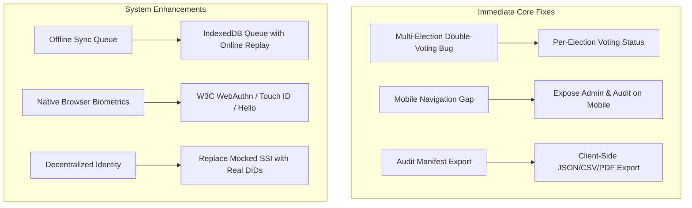

# BioChain Vote — Important Implementation Updates

**Repository:** `sudoantonkill/biochain-vote`  
**Branch:** `added-analytics`  
**Status Date:** October 2026  
**Hardware Notice:** *Physical Nitgen fingerprint scanner integration is deferred for later. All biometric flows currently run via simulated verification (`SIM:verified`) and PIN fallback.*

---

## 1. Executive Action Plan

This document details the critical engineering updates required for **BioChain Vote** across architecture, user experience, and data integrity.



---

## 2. Immediate Updates to Apply

### Update 1: Multi-Election Double-Voting Fix
* **Affected Files:** [`src/services/apiService.ts`](file:///c:/Users/OMMET/OneDrive/Desktop/projects/biochain-vote/src/services/apiService.ts), [`src/services/dbService.ts`](file:///c:/Users/OMMET/OneDrive/Desktop/projects/biochain-vote/src/services/dbService.ts)
* **Diagnosis:**
  Currently, `voterDB.hasVoted(voterId)` queries a single global boolean column `has_voted` on the voter record in Supabase:
  ```typescript
  // Flawed current check:
  const sbVoted = await voterDB.hasVoted(voterId);
  const localVoted = await localBlockchain.hasVoterVoted(voterId, electionId);
  if (sbVoted || localVoted) {
    throw new Error('You have already voted. Double voting is not allowed.');
  }
  ```
  Once a citizen votes in an initial election (e.g., Lok Sabha), `sbVoted` becomes `true`, permanently preventing them from casting a ballot in any other active election (e.g., Vidhan Sabha or Municipal).
* **Action Required:**
  1. Scope voting verification strictly per `(voterId, electionId)`.
  2. Rely primarily on `localBlockchain.hasVoterVoted(voterId, electionId)` which iterates through vote blocks matching both `voterId` and `electionId`.
  3. When querying Supabase, query the `votes` table for an existing record matching both `voter_id` and `election_id`.

---

### Update 2: Mobile Navigation Access for Admin & Audit
* **Affected File:** [`src/components/layout/AppLayout.tsx`](file:///c:/Users/OMMET/OneDrive/Desktop/projects/biochain-vote/src/components/layout/AppLayout.tsx)
* **Diagnosis:**
  The desktop sidebar renders administration items (`/admin` and `/audit`) when `isAdmin` is `true`. However, the mobile fixed bottom bar (`isMobile && ...`) only maps `navItems`, completely omitting `adminItems`:
  ```tsx
  // Missing Admin links on mobile viewport:
  {isMobile && (
    <nav className="fixed bottom-0 ...">
      {navItems.map(...)} {/* Admin and Audit missing here! */}
    </nav>
  )}
  ```
* **Action Required:**
  1. When `isAdmin` is active on mobile devices, dynamically append `/admin` and `/audit` tabs, or render an Admin action sheet/drawer.
  2. Ensure poll workers on tablets or mobile phones have direct access to management dashboards.

---

### Update 3: Client-Side Certified Audit Manifest Export
* **Affected File:** [`src/pages/Audit.tsx`](file:///c:/Users/OMMET/OneDrive/Desktop/projects/biochain-vote/src/pages/Audit.tsx)
* **Diagnosis:**
  The Audit page allows pushing results to Supabase via "Publish Results", but has no mechanism for election officers or observers to download offline verification artifacts.
* **Action Required:**
  1. Add a **"Download Audit Manifest"** button with two export modes:
     - **JSON Manifest:** Contains the election ID, Merkle Root, block count, candidate breakdown, timestamps, and hash chain snapshot.
     - **CSV Summary:** Formatted table of candidates, party symbols, vote counts, percentages, and victory margins.
  2. Provide printable formatted stylesheets for physical paper-trail archiving.

---

### Update 4: Durable Offline Mutation Queue
* **Affected Files:** [`src/services/dbService.ts`](file:///c:/Users/OMMET/OneDrive/Desktop/projects/biochain-vote/src/services/dbService.ts), [`src/services/apiService.ts`](file:///c:/Users/OMMET/OneDrive/Desktop/projects/biochain-vote/src/services/apiService.ts)
* **Diagnosis:**
  If network connectivity drops during voting, attempts to update Supabase fail with unhandled promises or console warnings, and the mutations are not retried.
* **Action Required:**
  1. Create an `offline_sync_queue` object store in IndexedDB.
  2. Enqueue failed network updates with payload, endpoint, and timestamp.
  3. Register a background synchronization handler listening to `window.addEventListener('online')` to replay pending mutations.

---

## 3. Future Architectural Roadmap (Post-Hardware)

| Component | Target Architecture | Implementation Details |
| :--- | :--- | :--- |
| **WebAuthn Biometrics** | Native Browser Touch ID / Windows Hello | Implement `navigator.credentials.create()` and `navigator.credentials.get()` as the primary biometric modality for laptops, tablets, and smartphones. |
| **Real W3C SSI** | Verifiable Credentials & DIDs | Replace mock functions in `ssiService.ts` with `@veramo/core` or `did-jwt` using Ed25519 keypairs. |
| **LAN Multi-Booth Consensus** | P2P Ledger Convergence | Implement local WebSocket or WebRTC broker allowing 5–10 booth terminals in a polling station to replicate blocks without internet. |
| **Nitgen Scanner (Deferred)** | Physical USB Scanner Service | Connect `Vote.tsx` to `fingerprintVerify(voterId)` once the physical Nitgen scanner and C++ drivers are configured. |

---

## 4. Verification & Testing Checklist

- [ ] Cast votes across multiple elections with the same voter account to verify multi-election isolation.
- [ ] Inspect mobile viewport in DevTools to confirm Admin and Audit tabs are accessible.
- [ ] Export audit manifest JSON/CSV and verify that Merkle Root matches the Block Explorer.
- [ ] Disconnect internet connection in DevTools (Offline mode), cast a vote, and verify that the vote is stored safely in local IndexedDB.
