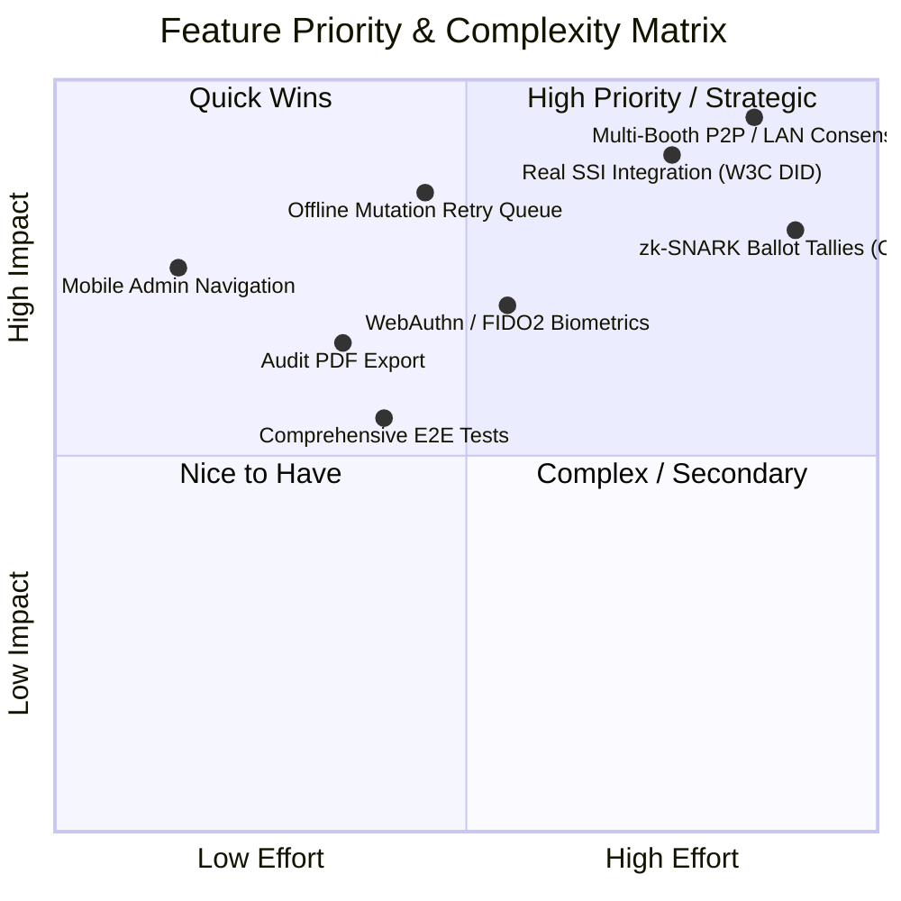

# BioChain Vote — Remaining Implementations & Gap Analysis

**Repository:** `sudoantonkill/biochain-vote`  
**Current Branch:** `added-analytics`  
**Version:** 1.0.0-rc  
**Last Updated:** October 2026  

---

## 1. Executive Summary

This document outlines the complete technical gap analysis and remaining engineering tasks for **BioChain Vote**. While the platform successfully implements an offline-first client-side blockchain, election analytics with Recharts, and local biometric verification with hardware fallback, several core production components remain mocked, incomplete, or decoupled.

---

## 2. Priority Matrix of Remaining Implementations

---

## 3. Detailed Breakdown of Incomplete Implementations

### 3.1 Self-Sovereign Identity (SSI) Service — 100% Mocked
* **Location:** [`src/services/ssiService.ts`](file:///c:/Users/OMMET/OneDrive/Desktop/projects/biochain-vote/src/services/ssiService.ts)
* **Current State:**
  * Uses arbitrary timeouts (`delay(1500)`) and generates pseudo-random hex strings: `did:biochain:${id}`.
  * Credential retrieval returns hardcoded static arrays.
* **Remaining Work:**
  1. Integrate standard decentralized identifier resolvers (e.g., `did:key` via Ed25519 or `did:ion`).
  2. Implement Verifiable Credential (VC) generation signed by the Election Commission private key.
  3. Support importing and scanning external VC wallets (Polygon ID, Disco, or standard W3C JWT VCs).

---

### 3.2 Multi-Booth / Distributed Peer-to-Peer Consensus
* **Location:** [`src/services/localBlockchain.ts`](file:///c:/Users/OMMET/OneDrive/Desktop/projects/biochain-vote/src/services/localBlockchain.ts), [`src/services/apiService.ts`](file:///c:/Users/OMMET/OneDrive/Desktop/projects/biochain-vote/src/services/apiService.ts)
* **Current State:**
  * Each device writes only to its own browser IndexedDB.
  * Polling stations with 5–10 booths running simultaneously cannot synchronize chains locally without an active internet connection to Supabase.
* **Remaining Work:**
  1. **LAN / P2P Sync Engine:** WebRTC DataChannels or local WiFi WebSocket broker (`local_sync_daemon.py`).
  2. **Consensus & Fork Choice:** Implement longest-chain or Raft consensus rules to resolve concurrent block production across booths.
  3. **Booth Block Export/Import:** Cryptographically signed JSON export/import mechanism for air-gapped tally aggregation.

---

### 3.3 Offline Mutation Queue & Background Synchronization
* **Location:** [`src/services/dbService.ts`](file:///c:/Users/OMMET/OneDrive/Desktop/projects/biochain-vote/src/services/dbService.ts), [`src/services/apiService.ts`](file:///c:/Users/OMMET/OneDrive/Desktop/projects/biochain-vote/src/services/apiService.ts)
* **Current State:**
  * When a vote is cast while offline, `voterDB.markVoted(voterId)` prints a console warning and silently drops the Supabase sync.
* **Remaining Work:**
  1. Implement an `offline_mutation_queue` object store in IndexedDB.
  2. Persist failed cloud sync operations (voter marked as voted, election status changes, audit logs).
  3. Attach window `online` listeners and a periodic sync worker to flush queued mutations with idempotency keys.

---

### 3.4 Mobile Responsive Navigation Gaps
* **Location:** [`src/components/layout/AppLayout.tsx`](file:///c:/Users/OMMET/OneDrive/Desktop/projects/biochain-vote/src/components/layout/AppLayout.tsx)
* **Current State:**
  * The bottom mobile navigation bar (`isMobile`) only includes standard voter tabs: `Home`, `Identity`, `Vote`, `Verify`, `Explorer`, `Profile`.
  * The `adminItems` (`/admin`, `/audit`) are completely omitted on mobile screens, making administration inaccessible to poll workers using tablets or mobile phones.
* **Remaining Work:**
  1. Add an Admin dropdown, slide-out drawer, or dynamic mobile tabs when `isAdmin` is active.

---

### 3.5 Native Browser Biometrics (WebAuthn / FIDO2)
* **Location:** [`src/services/biometricService.ts`](file:///c:/Users/OMMET/OneDrive/Desktop/projects/biochain-vote/src/services/biometricService.ts)
* **Current State:**
  * Relies entirely on the external Windows-only Nitgen C++ daemon (`fingerprint-service/`) or simulated strings (`SIM:`).
* **Remaining Work:**
  1. Integrate the W3C WebAuthn API (`navigator.credentials.create` and `get`).
  2. Enable voters to use Apple Touch ID, Windows Hello, or Android Biometric authentication without proprietary USB hardware.

---

### 3.6 True Zero-Knowledge Proof (ZKP) Ballot Privacy
* **Location:** [`src/services/blockchainService.ts`](file:///c:/Users/OMMET/OneDrive/Desktop/projects/biochain-vote/src/services/blockchainService.ts)
* **Current State:**
  * Uses a simple SHA-256 commit-reveal hash `SHA256(candidateId + nonce)`.
* **Remaining Work:**
  1. Implement Circom arithmetic circuits for ballot secrecy (proof that vote is for a valid candidate index without revealing which one).
  2. Client-side proof generation using `snarkjs` with verification on the ledger.

---

### 3.7 Certified Audit Export & Reporting
* **Location:** [`src/pages/Audit.tsx`](file:///c:/Users/OMMET/OneDrive/Desktop/projects/biochain-vote/src/pages/Audit.tsx)
* **Current State:**
  * Audit results can only be viewed in the UI or pushed to Supabase.
* **Remaining Work:**
  1. Implement client-side PDF export (using `jspdf` or printable stylesheets) containing:
     - Merkle root hash.
     - Final tallies and turnout percentages.
     - Candidate breakdown and victory margin.
     - Cryptographic verification QR code.
  2. CSV/JSON raw ledger export for election observers and political party agents.

---

### 3.8 Test Suite & Integrity Validation
* **Location:** [`vitest.config.ts`](file:///c:/Users/OMMET/OneDrive/Desktop/projects/biochain-vote/vitest.config.ts), `src/test/`
* **Current State:**
  * No automated tests validating double-voting edge cases, tampering alerts in `verifyChain()`, or Merkle tree proof validity across odd/even leaf counts.
* **Remaining Work:**
  1. Unit tests for `localBlockchain.ts` (Genesis, block linkage, tampering detection, Merkle proofs).
  2. Unit tests for `apiService.ts` (double vote prevention, booth segregation).
  3. Playwright or Cypress E2E flows testing the complete voting lifecycle.

---

## 4. Phased Implementation Roadmap

| Phase | Target Deliverables | Estimated Effort |
| :--- | :--- | :--- |
| **Phase 1: Quick Wins** | Fix mobile admin navigation, add PDF/CSV export in Audit page, improve error banners. | 1–2 Days |
| **Phase 2: Offline Resilience** | Durable IndexedDB mutation queue, automatic background flush when online, sync retry indicator. | 2–3 Days |
| **Phase 3: Biometrics & SSI** | Integrate WebAuthn (Touch ID / Windows Hello) and standard W3C DID / Verifiable Credentials. | 3–5 Days |
| **Phase 4: Multi-Node Consensus** | Local LAN P2P synchronization daemon, conflict resolution, block export/import bundles. | 1–2 Weeks |
| **Phase 5: Advanced ZKP** | Circom zk-SNARK circuits for private tallying and zero-knowledge receipts. | 2 Weeks |
