# BioChain Vote — Implementation Status & Remaining Work

**Branch:** `added-analytics`  
**Repository:** `sudoantonkill/biochain-vote`  
**Status Date:** October 2026  
**Architecture:** Offline-First Decoupled Web3 + Biometric Electronic Voting Architecture (React, TypeScript, Vite, Tailwind CSS, IndexedDB, Web Crypto API, Supabase)

---

## 1. Executive Summary

BioChain Vote is a tamper-resistant, offline-first biometric electronic voting system tailored for robust electoral operations. The `added-analytics` branch enhances the core voting platform with offline analytical processing, cryptographic Merkle audit mechanisms, and decentralized verification tools.

This document provides a comprehensive audit of:
1. **What has been implemented and tested.**
2. **Key architectural additions in this branch.**
3. **Remaining implementations, incomplete services, and technical gaps.**
4. **Prioritized engineering roadmap for production readiness.**

---

## 2. Completed Implementations (Current Capabilities)

### 2.1 Offline Local Blockchain & Merkle Tree Ledger
- **Client-Side SHA-256 Blockchain:** Implemented in `src/services/localBlockchain.ts` using the browser's native `crypto.subtle` (Web Crypto API).
- **Cryptographic Chain Integrity Verification:** `verifyChain()` walks all blocks sequentially, recomputes hashes deterministically, and validates block linkage against previous block hashes.
- **Merkle Tree & Inclusion Proofs:**
  - Dynamic binary Merkle tree generated over all vote transaction hashes (`buildMerkleTree`).
  - Merkle inclusion proof generator (`getMerkleProof`) producing proof path steps (`left` / `right`).
  - Client-side Merkle proof verification (`verifyMerkleProofLocal`) to cryptographically prove that an individual vote is included in the published Merkle root.
- **IndexedDB Persistence:** Complete storage abstraction in `src/services/dbService.ts` (`blockDB`) preserving ledger state across browser restarts and offline network states.

### 2.2 Advanced Election Analytics & Audit System (`Audit.tsx` & `localBlockchain.ts`)
- **Real-Time Offline Vote Tallying:** Automatically analyzes cast votes directly from the local blockchain blocks without network roundtrips.
- **Visual Analytics Suite (Recharts):**
  - **Vote Share Distribution:** Interactive Pie/Donut charts displaying party vote counts, percentages, and custom party color tokens.
  - **Candidate Comparison:** Responsive Bar charts tracking each candidate's vote total.
  - **Turnout Over Time:** Hourly Area charts displaying voting velocity and voter traffic patterns.
  - **Polling Station / Booth Breakdown:** Per-booth granularity tracking vote counts and candidate preferences per voting station.
- **Margin of Victory & Winner Resolution:** Automated computation of winner, runner-up, vote margin, and percentage leads.
- **Supabase Cloud Publication:** Admin action to export and publish offline tallies and individual vote receipts to Supabase for global tally consolidation.

### 2.3 Web3 Wallet Signing & Zero-Knowledge Hash Commitments
- **MetaMask / Ethers v6 Integration:** `blockchainService.ts` provides real ECDSA signature verification via `personal_sign` binding voter authorization to the transaction payload.
- **Commitment-Reveal Privacy Model:** SHA-256 hash-based commit-reveal scheme (`createVoteCommitment` & `verifyCommitment`) enabling voters to verify their vote intent without revealing ballot secrecy during tallying.

### 2.4 Biometric Authentication & Hardware Integration
- **Nitgen eNBioScan-C1 Hardware Service:** Dedicated local Python worker (`fingerprint-service/`) interfacing with `NBioBSP.dll` and `NITGEN.SDK.NBioBSP.dll`.
- **Intelligent Offline Fallback:** When physical USB scanners are absent, a simulated biometric flow (`SIM:verified`) ensures local testing and offline booth demos function without crashes.
- **Multi-Factor Auth at the Booth:** Voters authenticate using Biometric scan, Master PIN, or voter ID credentials.

### 2.5 Administrative Management Suite (`Admin.tsx`)
- **PIN-Protected Admin Console:** Secure gatekeeper for poll workers and election commissioners.
- **Voter Management:** Full CRUD operations for voter roll registration, constituency assignment, and fingerprint enrollment status.
- **Election Lifecycle Management:** Dynamic creation, scheduling, status toggling (`upcoming`, `active`, `completed`), and constituency filtering.
- **Candidate Management:** Candidate registration with party affiliation, manifestos, age, qualifications, and party symbols.
- **Booth Allocation:** Multi-booth assignment module mapping voters and specific elections to individual polling stations.
- **Local DB Inspector:** Direct transparency viewer for all underlying IndexedDB tables and cryptographic block records.

### 2.6 Public Transparency & Verification
- **Block Explorer (`Explorer.tsx`):** Complete inspection portal for genesis blocks, transaction payloads, timestamps, nonces, and block hashes, with both list view and hash chain visualizer.
- **Independent Ballot Verifier (`Verify.tsx`):** Allows any voter to input their transaction hash to verify Merkle root inclusion, leaf hashes, and chain integrity.

---

## 3. Remaining Implementations & Technical Gaps

The following table categorizes all pending features and architectural requirements:

| Priority | Component / Feature | Current State | Target Implementation Needed |
| :--- | :--- | :--- | :--- |
| **P0 (Critical)** | **Self-Sovereign Identity (SSI)** | Mocked (`ssiService.ts`) with hardcoded timeouts and fake DIDs | Implement standard W3C DID specification (`did:key` or `did:ion`) and Verifiable Credentials (VCs). |
| **P0 (Critical)** | **Multi-Booth Ledger Synchronization** | Isolated per-browser IndexedDB instance | Multi-node consensus or peer-to-peer sync (WebRTC / local LAN WebSocket broker) between booth laptops. |
| **P1 (High)** | **Offline Mutation Queue & Auto-Retry** | Supabase updates drop with console warnings if offline | Durable offline sync queue in IndexedDB with exponential backoff when connectivity returns. |
| **P1 (High)** | **Mobile Admin Navigation** | Missing from mobile bottom bar in `AppLayout.tsx` | Add dynamic admin navigation tabs or responsive drawer for mobile poll workers. |
| **P1 (High)** | **WebAuthn / FIDO2 Native Biometrics** | Relies solely on Nitgen USB scanner / mock | Add W3C WebAuthn API (Windows Hello, Touch ID, Android Fingerprint) for standard consumer devices. |
| **P2 (Medium)** | **Zero-Knowledge Proofs (ZKP)** | Simple SHA-256 hash commit-reveal | Migrate to zk-SNARKs / Circom circuits for zero-knowledge verifiable tallying without revealing individual choices. |
| **P2 (Medium)** | **Real-Time Vote Stream / SSE** | Polls database on load or manual refresh | Add Supabase Realtime / WebSocket subscriptions for live turnout dashboards. |
| **P2 (Medium)** | **PDF / CSV Report Export** | Not implemented on Audit page | Export certified election audit reports (PDF with cryptographic signatures and QR codes). |
| **P3 (Low)** | **Automated Unit & E2E Testing** | Vitest configured but sparse test suites | Automated test suite covering double-voting prevention, Merkle tree edge cases, and tamper detection. |

---

## 4. In-Depth Breakdown of Remaining Work

### 4.1 Self-Sovereign Identity (SSI) Service
- **File:** `src/services/ssiService.ts`
- **Issue:** All methods (`generateDID`, `getCredentials`, `exportCredential`) use simulated `setTimeout` delays and mock strings.
- **Required Action:**
  1. Integrate a lightweight DID library (such as `@veramo/core` or `did-jwt`).
  2. Issue cryptographic Verifiable Credentials (VC) signed by the Election Authority upon voter registration.
  3. Allow voters to import their credential JSON-LD or QR code into the application.

### 4.2 Multi-Booth / Distributed Sync Mechanism
- **File:** `src/services/localBlockchain.ts`, `src/services/apiService.ts`
- **Issue:** In an actual election, multiple voting booths run concurrently at a polling station. Currently, each client writes solely to its local browser IndexedDB.
- **Required Action:**
  1. Implement an export/import mechanism for blockchain blocks (JSON / encrypted bundle).
  2. Implement an offline LAN synchronization service using WebRTC or a lightweight local server broker (`local_sync_server.py`) so multiple voting machines converge on the same ledger using longest-valid-chain or Raft consensus rules.

### 4.3 Offline Resilient Supabase Queue
- **File:** `src/services/dbService.ts`, `src/services/apiService.ts`
- **Issue:** `voterDB.markVoted(voterId)` directly attempts a network call to Supabase and swallows errors if the booth has no internet.
- **Required Action:**
  1. Introduce an `offlineSyncQueue` store in IndexedDB.
  2. Queue all voter status mutations and audit events when offline.
  3. Listen to browser `online` events and flush queued operations idempotently.

### 4.4 Mobile Layout Admin Access
- **File:** `src/components/layout/AppLayout.tsx`
- **Issue:** The mobile navigation bar (`isMobile && <nav className="fixed bottom-0 ...">`) only renders `navItems` (Home, Identity, Vote, Verify, Explorer, Profile). Poll workers using tablets or mobile devices cannot navigate to `/admin` or `/audit`.
- **Required Action:**
  1. Render an "Admin" and "Audit" button in the mobile navbar when `isAdmin` is true, or introduce a sliding sheet/drawer.

### 4.5 Certified Audit Report Generation
- **File:** `src/pages/Audit.tsx`
- **Issue:** Election officers need physical paper trail and downloadable audit manifests.
- **Required Action:**
  1. Add a "Download Certified Audit Manifest" button using `jspdf` or HTML print stylesheets.
  2. Include the Merkle Root, block height, total valid votes, candidate tallies, timestamp, and digital verification QR code.

---

## 5. Recommended Implementation Order (Phased Plan)

```mermaid
graph TD
    A[Phase 1: Critical Fixes & UX] --> B[Phase 2: Offline Resilience & Sync]
    B --> C[Phase 3: Real SSI & WebAuthn]
    C --> D[Phase 4: Advanced ZKP & Audits]

    A1[Fix Mobile Admin Navigation in AppLayout] --> A
    A2[Add Audit PDF/CSV Export in Audit.tsx] --> A

    B1[IndexedDB Offline Sync Queue for Supabase] --> B
    B2[Multi-Booth Local Export/Import & LAN Sync] --> B

    C1[Replace ssiService with Real W3C DIDs] --> C
    C2[Integrate WebAuthn/FIDO2 Browser Biometrics] --> C

    D1[zk-SNARK Ballot Verification Circom/SnarkJS] --> D
    D2[Comprehensive Vitest Integration Suite] --> D
```



---

## 6. How to Run & Validate the Current System

1. **Install Dependencies:**
   ```bash
   npm install
   ```
2. **Start Development Server:**
   ```bash
   npm run dev
   ```
3. **Run Nitgen Fingerprint Daemon (Optional for Physical Scanner):**
   ```bash
   cd fingerprint-service
   python api.py
   ```
4. **Access the Application:**
   - **Voter Portal:** `http://localhost:8080/dashboard` (Default PIN / Password: `1234`)
   - **Admin Portal:** `http://localhost:8080/admin` (Default Admin PIN: `1234` or stored admin credentials)
   - **Audit & Analytics:** `http://localhost:8080/audit`
   - **Block Explorer:** `http://localhost:8080/explorer`
   - **Independent Verification:** `http://localhost:8080/verify`
